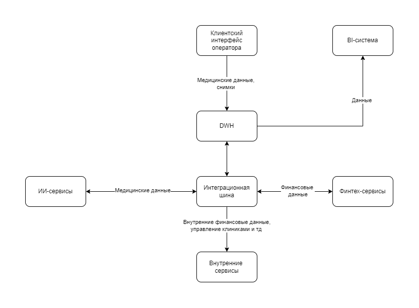

# Анализ проблемных зон IT-ландшафта "Будущее 2.0"

## Схема актуальных потоков данных

## Критические проблемы (Must Have)

### 1. Устаревшая технологическая база DWH

- **SQL Server 2008** - неподдерживаемая версия, уязвимости безопасности
- **Power Builder** - устаревшая платформа, дефицит специалистов
- **Отсутствие современной архитектуры** для обработки больших данных

### 2. Низкая производительность аналитики

- **Часы ожидания** для сложных отчетов
- **Сотни терабайт** данных в неоптимальной структуре
- **Множественные трансформации** замедляют получение результатов

### 3. Отсутствие масштабируемости

- **Невозможность быстрого подключения** новых бизнес-направлений
- **Критическая зависимость** бизнес-логики от СУБД
- **Высокая стоимость** изменений и доработок

## Серьезные проблемы (Should Have)

### 4. Нарушение доменных границ

- **Риски безопасности** данных из-за монолитной архитектуры
- **Смешение данных** из медицинской, финансовой и операционной областей
- **Риски compliance** (медицинская тайна, банковская тайна)

### 5. Отсутствие самообслуживания

- **Нет инструментов** для самостоятельного анализа
- **Зависимость от IT** для создания отчетов
- **Высокий time-to-market** для новых отчетов

### 6. Неэффективная интеграция

- **Устаревшая шина данных** на Apache Camel
- **Сложность подключения** новых систем
- **Высокие операционные расходы** на поддержку интеграций

## Желательные улучшения (Could Have)

### 7. Разрозненность технологических стеков

- **Python** для ИИ-сервисов
- **Golang/Java** для финтех-сервисов
- **.NET** для legacy-систем
- **Сложность взаимодействия** между компонентами

### 8. Отсутствие Data Governance

- **Нет единой политики** управления данными
- **Сложность обеспечения** качества данных
- **Отсутствие метаданных** и data catalog

## Приоритизация по матрице Эйзенхауэра

|              | Срочно                                         | Не срочно                                          |
| ------------ | ---------------------------------------------- | -------------------------------------------------- |
| **Важно**    | • Производительность DWH • Технический долг | • Архитектура масштабирования • Data Governance |
| **Не важно** | • Интеграция новых систем                      | • Оптимизация Тех. стека                           |

## Ключевые выводы для бизнеса

1. **Текущая архитектура сдерживает рост** бизнеса и добавление новых направлений
2. **Задержки в отчетности** снижают актуальность управленческих решений
3. **Риски compliance** могут привести к серьезным штрафам
4. **Высокая стоимость владения** устаревшими системами
5. **Необходима срочная модернизация** для сохранения конкурентных преимуществ
